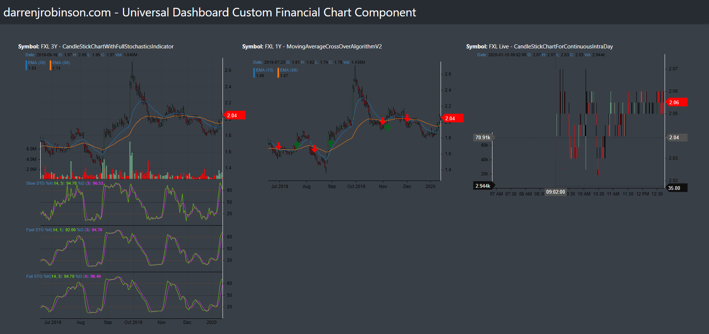

# UniversalDashboard.UDFinancialChart
React-Stockcharts for Universal Dashboard.

[Available in the PowerShell Gallery](https://www.powershellgallery.com/packages/UniversalDashboard.UDFinancialChart)

## Install
Install direct from the PowerShell Gallery (Powershell 5.x and above)
```
install-module -name UniversalDashboard.UDFinancialChart
```

## DESCRIPTION
v1.0.1 includes 4 additional charts CandleStickChartWithMACDIndicator, CandleStickChartWithRSIIndicator, CandleStickChartWithBollingerBandOverlay, "CandleStickChartWithMA

CandleStickChartWithFullStochasticsIndicator, MovingAverageCrossOverAlgorithmV2 and CandleStickChartForContinuousIntraDay [React-StockCharts](https://github.com/rrag/react-stockcharts) for [Universal Dashboard](https://universaldashboard.io/)  

## Example Charts


## Universal Dashboard Component Syntax
Default Chart (MovingAverageCrossOverAlgorithmV2)
```
New-FinancialChart -stockData "http://localhost:10010/StockData.csv"
```
MovingAverageCrossOverAlgorithmV2 Chart
```
New-FinancialChart -stockData "http://localhost:10010/StockData.csv" -chartType 'MovingAverageCrossOverAlgorithmV2'
```

## INPUTS
(required) stockData - CSV delimited Stock Data

    (case sensitvie and ordered) Header Columns are;
    ```
    Open,High,Close,Low,Volume,Date
    ```

    Date format MUST be dd-mm-yyyy (e.g 17-01-2017) except for CandleStickChartForContinuousIntraDay ( date format MUST be in <dd-mm-yyyy hh:mm:ss> ). Days less than 10 must be 0 padded. e.g 01-12-2020 for 1 Dec 2020.
    Transform the data using PowerShell something like this;

    * 1 Year Stock History Data Transformation, remove double quotes, date into <dd-mm-yyyy> format
    ```
    $1y | Select-Object | ConvertTo-Csv -NoTypeInformation -Delimiter "," | ForEach-Object { $_ -replace '"', '' } | ForEach-Object { $_ -replace '/', '-' } | ForEach-Object { $_ -replace ',1-', ',01-' } | ForEach-Object { $_ -replace ',2-', ',02-' } | ForEach-Object { $_ -replace ',3-', ',03-' } | ForEach-Object { $_ -replace ',4-', ',04-' } | ForEach-Object { $_ -replace ',5-', ',05-' } | ForEach-Object { $_ -replace ',6-', ',06-' } | ForEach-Object { $_ -replace ',7-', ',07-' } | ForEach-Object { $_ -replace ',8-', ',08-' } | ForEach-Object { $_ -replace ',9-', ',09-' } | out-file -encoding ASCII "C:\chartdata\StockData.csv"
    ```

(optional) chartType - defaults to MovingAverageCrossOverAlgorithmV2
    "CandleStickChartWithFullStochasticsIndicator", "MovingAverageCrossOverAlgorithmV2", "CandleStickChartForContinuousIntraDay"

## Stock Data is retrieved from a local URL
Requires a small NodeJS WebServer to serve up the Stock Data Files. Makes it easy to reference the data 
[Example](https://github.com/darrenjrobinson/NodeWebFileServer)

### Syntax
node server.js <path_to_stockdata> port

Example 
```
node server.js 'C:\chartdata' 10010 
```

## Example Universal Dashboard

```
import-module UniversalDashboard.Community
import-Module UniversalDashboard.UDFinancialChart

Get-UDDashboard | Stop-UDDashboard

$Theme = New-UDTheme -Name "darrenjrobinson" -Definition @{
    '.dropdown-content'                                                                                 = @{
        'min-width' = '450px'
    }
    '.btn-floating'                                                                                     = @{
        'background-color' = '#26a69a'
    }
    '.collection .collection-item'                                                                      = @{
        'line-height' = '1.0rem'
        'padding'     = '5px 10px';
    }  
    '.ud-grid'                                                                                          = @{
        'color' = '#ffab40'
    } 
    '.card, .card-panel'                                                                                = @{
        'color' = '#ffab40' 
    }
    '.card .card-action a:not(.btn):not(.btn-large):not(.btn-small):not(.btn-large):not(.btn-floating)' = @{
        'color' = '#ffab40' 
    }
} -Parent DarkDefault

$myDashboard = New-UDDashboard -Title "darrenjrobinson.com - Universal Dashboard Custom Financial Chart Component" -Content {    
    New-UDLayout -Columns 3 -Content {  
        New-UDRow -Id "FinChart1" -Endpoint {      
            New-UdHtml -Markup "<b>Symbol:</b> FXL 3Y - CandleStickChartWithFullStochasticsIndicator</br>" 
            New-UDRow -Id "CandleStickChartWithFullStochasticsIndicator" -Endpoint {                        
                New-FinancialChart -stockData "http://localhost:10010/FXL-AX-3y.csv" -chartType CandleStickChartWithFullStochasticsIndicator
            }                          
        } 
        New-UDRow -Id "FinChart2" -Endpoint {      
            New-UdHtml -Markup "<b>Symbol:</b> FXL 1Y - MovingAverageCrossOverAlgorithmV2</br>" 
            New-UDRow -Id "MovingAverageCrossOverAlgorithmV2" -Endpoint {                        
                Start-Sleep -Seconds 2
                New-FinancialChart -stockData "http://localhost:10010/FXL-AX-1y.csv" -chartType MovingAverageCrossOverAlgorithmV2
            }                             
        }
        New-UDRow -Id "FinChart3" -Endpoint {  
            New-UdHtml -Markup "<b>Symbol:</b> FXL Live - CandleStickChartForContinuousIntraDay</br>"     
            New-UDRow -Id "CandleStickChartForContinuousIntraDay" -Endpoint {                        
                Start-Sleep -Seconds 1
                New-FinancialChart -stockData "http://localhost:10010/FXL-AX-LiveData.csv" -chartType CandleStickChartForContinuousIntraDay
            }                          
        } -AutoRefresh -RefreshInterval 25 # Refresh the Graph
    }
} -Theme $Theme

Start-UDDashboard -ListenAddress 127.0.0.1 -Port 11000 -Dashboard $myDashboard -Force
```

## LINKS

[blog](https://blog.darrenjrobinson.com/react-stockcharts-for-powershell-universal-dashboard/) https://blog.darrenjrobinson.com/react-stockcharts-for-powershell-universal-dashboard/

[twitter](https://twitter.com/darrenjrobinson) https://twitter.com/darrenjrobinson
